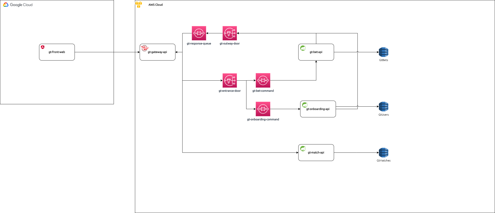

# Documentos e Especificações

## Arquitetura

Na imagem acima, podemos ver duas clouds distintas.

A primeira, teremos `Goougle Cloud` para upload do nosso portal de apostas em `Angular` publicado através do `Firebase`.

Olhando para segunda (`AWS Cloud`), temos uma visão de backend que envolve diversos componentes e serviços.

Iniciamos a porta de entrada através de um micro-serviço em `Spring` utilizando `Netflix Zuul` como gerenciador de rotas e gateway para aplicações internas do nosso sistema.

Após isso, podemos visualizar um conjunto de serviços de mensageria para realizar a comunicação de maneira assincrona com serviços de apostas(`gt-bests-api`) e criação de contas(`gt-onboarding-api`). Ambos irão utilizar o Banco de Dados NoSQL da AWS (`DynamoDB`).

E por fim, não menos importante, uma api(`gt-match-api`) para criação de FT's / Partidas que também irá armazenas suas informações em uma tabela do DynamoDB.

## Setup Ambiente

Para saber mais sobre setup de ambiente, acessa a [página](./setup_ambiente/) com a sessão específica.